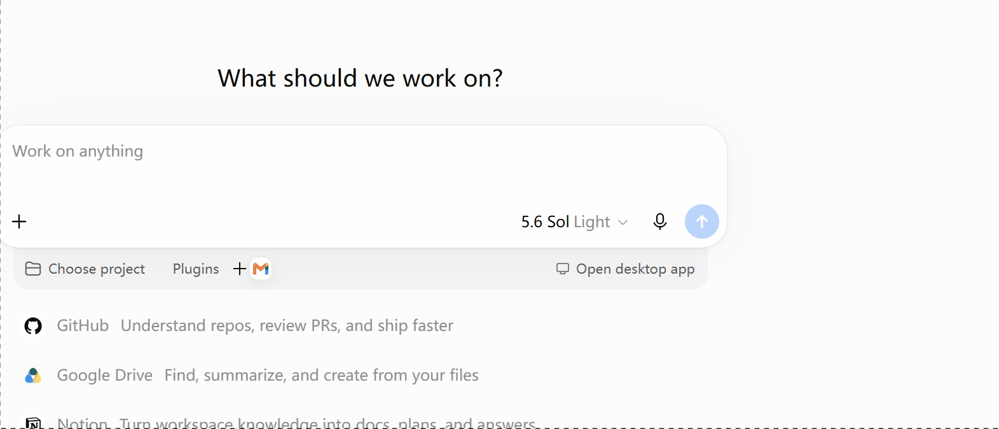

# SelectionTranslator for Windows

**Select text. Release the mouse. See the translation — no hotkey, no extra click.**

Windows 11 划词翻译工具：在其他应用中选中文字，松开鼠标后自动显示译文。无需复制粘贴、无需快捷键，也无需再点击“翻译”。

[⬇️ **Download v0.4.6 (.zip)**](https://github.com/weiffrank528-rgb/SelectionTranslator-Windows/releases/download/v0.4.6/SelectionTranslator-Windows-0.4.6.zip) · [Release notes / 更新说明](https://github.com/weiffrank528-rgb/SelectionTranslator-Windows/releases/tag/v0.4.6) · [Report an issue / 反馈问题](https://github.com/weiffrank528-rgb/SelectionTranslator-Windows/issues)

> **Alpha preview / 预览版（0.4.6）**：核心功能可用，但不同应用的文字选取支持存在差异。欢迎提交不含敏感内容的兼容性反馈。

## Demo



## Highlights / 核心亮点

- 🖱️ **No-hotkey workflow** — drag to select, double-click a word, or triple-click supported text; translation starts automatically.
- ⚡ **One smooth action** — no copy-and-paste and no second “Translate” click.
- 🪟 **Works across common Windows apps** — designed for browsers, Word, WPS, text-based PDFs, VS Code, and chat apps, with UI Automation and a safe clipboard fallback.
- 🌐 **Multiple translation engines** — MyMemory works without an API key; Google Cloud Translation, OpenAI, and DeepL are also supported.
- 🔊 **Focus-friendly popup** — copy text or translation and read the source aloud without taking keyboard focus from the app you are using.

---

## Technical details / 技术说明

## 当前能力

- 全局检测左键拖选、双击选词和三击扩展选区；钩子始终把原始鼠标消息继续传给目标应用，不吞点击、不改选区。
- 优先使用 Windows UI Automation `TextPattern.GetSelection()` 读取所选文本及选区矩形。
- UI Automation 不可用时，可选地发送一次 `Ctrl+C`；仅当原剪贴板为空或只含纯文本格式时才执行，并在读取后恢复原文本。
- 无焦点浮窗在选区末端或鼠标附近出现，不抢走当前应用焦点；支持自动隐藏。
- 放大后的交互式卡片浮窗提供“复制原文”“复制译文”和“朗读原文/停止朗读”按钮。浮窗使用 `WS_EX_NOACTIVATE`，显示或点击按钮都不抢目标应用的键盘焦点，因此原应用中的 `Ctrl+C` 仍可正常使用。
- 翻译引擎可选：
  - MyMemory：默认、免 Key 的公共基础方案；可在本机即时区分中文/英文源文本。
  - Google Cloud Translation：官方 Basic v2 API，支持 API Key 和源语言自动识别。
  - OpenAI：Responses API，可配置地址、模型与 API Key。
  - DeepL：可配置 Free/Pro API 地址与 API Key。
- 可设置白名单、黑名单、最短拖动时间、最小拖动距离、取词延迟、UIA 超时、最少/最多字符数和自动隐藏时间。
- 浮窗停留时间以秒为单位，可精确到 0.5 秒；设为 `0` 可关闭定时隐藏。默认点击浮窗外任意位置或切换到其他应用时会立即隐藏，并取消尚未完成的翻译，且不会拦截点击。
- 点击浮窗外部、关闭浮窗或开始新的划词时，会同步停止正在播放的朗读。若没有匹配原文语言的 Windows 语音，将回退到系统默认语音。
- 中文/英文自动检测采用双向模式：原文与设置的目标语言相同时，会自动切换到另一种语言。例如目标设为 `en` 时，中文译英文、英文自动译中文，避免向 MyMemory 发送相同语言对。
- 浮窗会按本次实际语言显示“自动识别：中文/英文”和“中文翻译/英文翻译”，朗读也使用检测后的原文语言。
- 再次双击程序时会显示“已在运行”操作窗口，可直接打开现有实例的设置、重新启动或取消；重新启动也兼容不支持实例通信的旧版本。
- 触摸板只要产生标准的 Windows 左键按下—移动—松开事件（实体按压拖动、双击后拖动等），与鼠标走同一链路。
- WPS Writer / WPS PDF 提供单独的增强兼容模式：允许 WPS 同进程浮动工具窗出现，延长复制等待时间，并通过标准 OLE 数据对象暂存和恢复复杂剪贴板；可在设置中关闭。
- 剪贴板兜底按顺序执行并等待内容稳定，只接受程序请求复制之后产生的文本，不再把鼠标松开后的任意剪贴板变化误认为当前选区。若无法安全确认当前文本，会显示提示并跳过，避免翻译旧内容。
- 密码输入框会被 UI Automation 检测并跳过；Google/OpenAI/DeepL Key 使用当前 Windows 用户的 DPAPI 加密后保存。

## 运行

普通用户可从仓库的 [Releases](../../releases) 下载 `SelectionTranslator-Windows-*.zip`，解压后双击 `SelectionTranslator.exe`。源码构建版本位于：

```text
outputs\SelectionTranslator-Release\SelectionTranslator.exe
```

双击运行后应用常驻系统托盘。到浏览器、Word、PDF 阅读器、VS Code 或聊天软件里左键拖选一段文字并松开即可；也可以双击选择单词，或在支持三击选段的应用中快速点击三次。右键托盘图标可暂停、打开设置或退出。

默认使用 MyMemory 并开启中文/英文自动检测，目标语言为 `zh-CN`。自动检测开启时，中英文会双向翻译：目标为 `zh-CN` 时英文译中文、中文自动译英文；目标为 `en` 时中文译英文、英文自动译中文。关闭自动检测后仍可手动填写源语言，此时目标语言不再自动切换；Google/DeepL 的源语言识别请求仍由各自服务端处理。

### 配置 Google 翻译

1. 在 Google Cloud 创建或选择项目，启用结算和 Cloud Translation API。
2. 创建 API Key，并把该 Key 的 API 限制设置为 Cloud Translation API。
3. 在托盘菜单打开“设置”，选择 `Google`，填入 API Key。
4. 源语言填 `auto` 可自动识别，目标语言保持 `zh-CN`。

本应用使用官方 Cloud Translation Basic v2，不调用 Google 翻译网页的非公开接口。

## 从源码构建

### 一键构建（本机无需 .NET SDK）

Windows 11 通常已带 .NET Framework 4.8 运行时；仓库的脚本使用系统的 .NET Framework C# 编译器：

```powershell
Set-ExecutionPolicy -Scope Process Bypass
.\build.ps1 -Configuration Release
```

输出到 `outputs\SelectionTranslator-Release`。

### Visual Studio

安装带“.NET 桌面开发”工作负载和 .NET Framework 4.8 Developer Pack 的 Visual Studio 2022，打开 `SelectionTranslator.sln`，选择 `Release | Any CPU` 后构建。

### 冒烟测试

```powershell
# 离线：验证全局钩子安装/卸载、窗口构造和默认引擎工厂
powershell -ExecutionPolicy Bypass -File .\test.ps1 -SkipNetwork

# 在线：额外向 MyMemory 发出一次 “Hello world” 测试请求
powershell -ExecutionPolicy Bypass -File .\test.ps1
```

## 实现路径

```text
WH_MOUSE_LL（只观察）
       │ 左键拖动并松开 / 双击 / 三击
       ▼
等待目标应用提交选区
       │
       ├─ UI Automation TextPattern.GetSelection
       │      └─ 文本 + 选区矩形
       │
       └─ 可选 Ctrl+C 兜底
              ├─ 保存原剪贴板
              ├─ 读取复制文本
              └─ 恢复原剪贴板
       │
       ▼
翻译引擎 → 不激活浮窗
```

低级鼠标回调中不做取词、网络或 UI 工作；它只记录坐标和时间并立即调用下一个钩子。UI Automation 在独立后台线程中运行并有超时，避免某个无响应的辅助功能提供者卡住界面。

## 兼容性与限制

实际兼容性取决于目标应用是否正确暴露 UI Automation，以及它对 `Ctrl+C` 的处理：

| 应用类型 | 首选路径 | 预期情况 |
|---|---|---|
| Edge/Chrome/Firefox 网页 | UI Automation，必要时 Ctrl+C | 普通可选网页文本通常可用 |
| Microsoft Word | UI Automation | 通常可直接取得文本与矩形 |
| WPS Writer / WPS PDF | UI Automation，必要时 WPS 兼容 Ctrl+C | 默认启用增强兼容；WPS 自带划词工具栏可以同时出现 |
| PDF 阅读器 | UI Automation 或 Ctrl+C | 文字型 PDF 通常可用；扫描 PDF 不可用 |
| VS Code | UI Automation 或 Ctrl+C | 编辑器/终端的提供者不同，兜底更常见 |
| 聊天软件 | UI Automation 或 Ctrl+C | 取决于消息控件是否允许选择/复制 |
| 图片、Canvas、视频字幕 | 不支持 | 当前版本没有 OCR |
| 管理员权限应用 | 可能受限 | Windows 完整性级别可能阻止普通权限进程读取/发送输入 |

本工具不会对图片、Canvas 或其他不可选文字自动做 OCR。OCR 是适合后续加入的独立路径，不能和“正常左键选区”混为一谈。

### 剪贴板兜底的边界

兜底过程会在约 260 毫秒内短暂改动剪贴板，然后恢复原纯文本。不同取词操作会串行完成复制与恢复；程序只接受主动发送 `Ctrl+C` 后出现且已短暂稳定的文本。鼠标松开后若剪贴板被其他程序或上一次操作更新，不会直接把其中的旧文本送去翻译。0.4.1 起不再尝试克隆任意 Win32 剪贴板句柄：只有原剪贴板为空，或只包含 `CF_TEXT`、`CF_OEMTEXT`、`CF_UNICODETEXT`、`CF_LOCALE` 这些安全文本格式时才会执行 Ctrl+C。遇到图片、HTML、OLE 对象或其他注册格式时，本次兜底直接跳过；如果同时检测到可疑的剪贴板变化，浮窗会提示重新选择。对剪贴板极敏感时，仍可在设置中关闭兜底，仅使用 UI Automation。

### 隐私与服务限制

- 选中的文本会发送给当前配置的翻译服务。不要翻译密码、API Key、未公开代码或私人消息。
- MyMemory 是免 Key 公共服务，但不是无限量免费：匿名使用为每天 5,000 字符，提供有效联系邮箱后为每天 50,000 字符；单请求仍有 500 字节限制，应用会自动分段。额度以 [MyMemory 官方 Usage Limits](https://mymemory.translated.net/doc/usagelimits.php) 为准。
- Google 选项使用官方 Cloud Translation Basic v2。需要 Google Cloud 项目、启用 Cloud Translation API、API Key 和结算账户；官方目前对 NMT 文本翻译提供每月前 500,000 字符的抵扣额度，超出后收费，具体以 [Google Cloud Translation 定价](https://cloud.google.com/translate/pricing) 为准。
- 对更高用量或更稳定的质量，建议配置 Google、OpenAI、DeepL，或后续接入本地 LibreTranslate/Argos Translate。
- API Key 使用 Windows DPAPI（当前用户范围）加密；其他非敏感设置保存在 `%APPDATA%\SelectionTranslator\settings.json`。

## 开源调研结论

- [新版 QTranslate](https://github.com/ahatem/QTranslate) 是 MIT 许可、插件化且成熟度较高的参考项目，但核心交互是“选中文字后按 `Ctrl+Q`”，技术栈为 Kotlin/Swing，无法直接提供本项目要求的左键松开触发。因此本 MVP 没有复制其代码，只借鉴了引擎可替换和快速浮窗的产品思路。
- Windows 官方的 [`TextPattern.GetSelection`](https://learn.microsoft.com/dotnet/api/system.windows.automation.textpattern.getselection) 正是无侵入读取当前文本选区的标准接口。
- 全局释放事件采用官方文档描述的 [`WH_MOUSE_LL` / `LowLevelMouseProc`](https://learn.microsoft.com/windows/win32/winmsg/lowlevelmouseproc)，并严格返回 `CallNextHookEx`，避免干扰目标程序。
- 默认免 Key 引擎使用 [MyMemory 官方 REST 规格](https://mymemory.translated.net/doc/spec.php)。Google 使用官方 [Cloud Translation Basic v2 REST API](https://cloud.google.com/translate/docs/basic/translating-text-basic)。OpenAI 实现采用官方 [Responses API 快速入门](https://developers.openai.com/api/docs/quickstart)，DeepL 实现采用 [DeepL Translate API](https://developers.deepl.com/api-reference/translate)。

## 项目结构

```text
src/SelectionTranslator/
  GlobalMouseHook.cs              全局左键拖动检测
  SelectionReader.cs              UI Automation 优先取词
  ClipboardSelectionReader.cs     Ctrl+C 与剪贴板恢复
  TranslationEngines.cs           MyMemory / Google / OpenAI / DeepL
  PopupForm.cs                     不抢焦点的翻译浮窗
  SpeechService.cs                 Windows 本地语音朗读
  SettingsForm.cs                  设置界面
  TranslatorApplicationContext.cs 托盘与完整流程编排
```

## 后续建议

1. 在目标用户常用软件上建立兼容性测试矩阵，并针对各 UIA Provider 做定向适配。
2. 加入本地 OCR（Windows OCR/Windows AI API）作为明确的屏幕框选模式，而不是偷偷截屏。
3. 加入真正本地的翻译后端（Argos Translate、LibreTranslate 自托管或 ONNX 模型）。
4. 使用 MSIX/签名安装包，增加开机启动选项与自动更新。

## 许可证

MIT，见 `LICENSE`。
